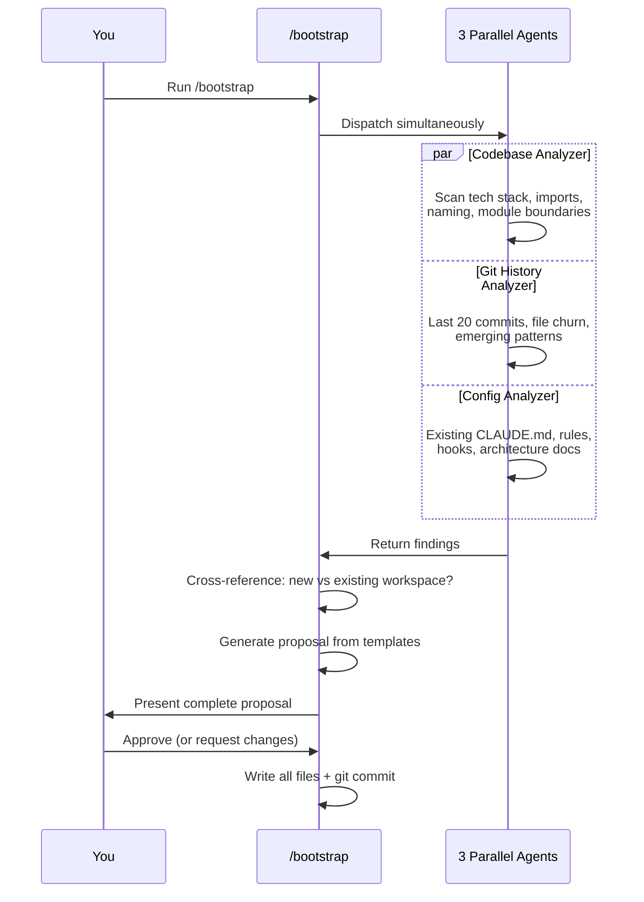
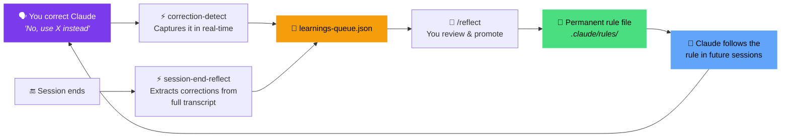
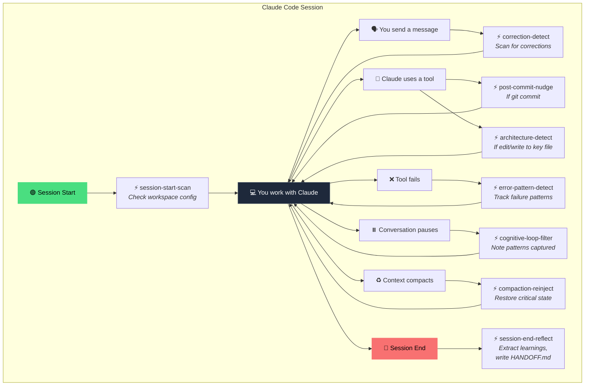
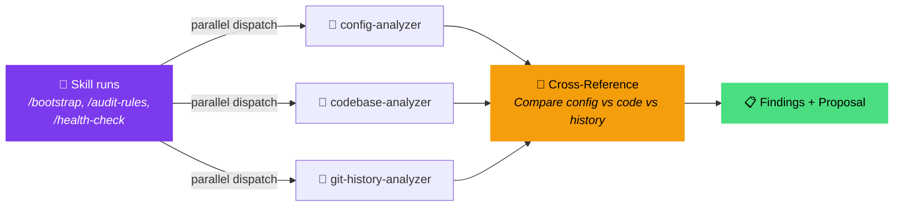
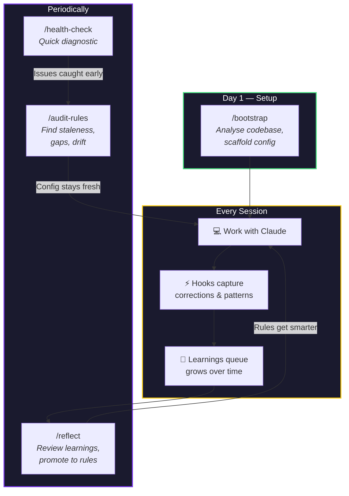

<p align="center">
  
  
  
  
</p>

<h1 align="center">🏗️ Bootstrap — Claude Code Plugin</h1>

<p align="center">
  <strong>A self-learning workspace quality system for Claude Code.</strong><br/>
  Analyses your codebase, scaffolds configuration, detects corrections you make during sessions,<br/>
  and evolves your project rules over time — so Claude gets smarter about <em>your</em> project with every conversation.
</p>

---

## 🧭 What This Plugin Does

Most Claude Code setups are static — you write a `CLAUDE.md` once, maybe add a few rules, and hope they stay relevant. This plugin makes that process **dynamic and self-improving**.

It does three things:

1. **🔍 Analyses** your codebase to understand your tech stack, patterns, and conventions
2. **📝 Scaffolds** complete Claude Code configuration tailored to what it finds
3. **🧠 Learns** from your corrections during sessions and promotes them into permanent rules

The result: your Claude Code configuration stays fresh, accurate, and aligned with how your codebase actually works — not how it worked three months ago.

---

## 📐 Architecture

```mermaid
graph TB
    subgraph Plugin["🏗️ Bootstrap Plugin"]
        direction TB
        subgraph Skills["📘 Skills — Things you can run"]
            S1["<strong>/bootstrap</strong><br/>Set up a new workspace"]
            S2["<strong>/audit-rules</strong><br/>Find stale or missing rules"]
            S3["<strong>/reflect</strong><br/>Promote learnings to rules"]
            S4["<strong>/health-check</strong><br/>Quick diagnostic report"]
        end

        subgraph Hooks["⚡ Hooks — Things that run automatically"]
            H1["session-start-scan"]
            H2["compaction-reinject"]
            H3["cognitive-loop-filter"]
            H4["session-end-reflect"]
            H5["correction-detect"]
            H6["post-commit-nudge"]
            H7["architecture-detect"]
            H8["error-pattern-detect"]
        end

        subgraph Agents["🤖 Subagents — Parallel investigators"]
            A1["config-analyzer"]
            A2["codebase-analyzer"]
            A3["git-history-analyzer"]
        end

        subgraph Data["💾 Runtime Data"]
            D1["learnings-queue.json"]
            D2["error-log.json"]
        end
    end

    S1 & S2 & S4 --> A1 & A2 & A3
    S3 --> D1
    H5 & H4 --> D1
    H8 --> D2

    style Plugin fill:#1a1a2e,stroke:#7C3AED,stroke-width:2px,color:#fff
    style Skills fill:#16213e,stroke:#4ade80,stroke-width:1px,color:#fff
    style Hooks fill:#16213e,stroke:#facc15,stroke-width:1px,color:#fff
    style Agents fill:#16213e,stroke:#60a5fa,stroke-width:1px,color:#fff
    style Data fill:#16213e,stroke:#f87171,stroke-width:1px,color:#fff
```



---

## 📘 Skills

Skills are commands you run yourself. Type them in Claude Code like any slash command.

### `/bootstrap` — Set up a new workspace

The main event. Run this when you enter a new repo or want to create/refresh your Claude Code configuration.

**What it creates:**

| File | Purpose |
|------|---------|
| `CLAUDE.md` | Project identity, tech stack, conventions, build commands (kept under 80 lines) |
| `.claude/rules/00-workspace.md` | Universal conventions that apply to every file |
| `.claude/rules/99-rule-iteration.md` | Meta-rule: tells Claude *how* to evolve the rules over time |
| Domain-specific rules | Path-scoped rules for major areas (e.g. `60-app-architecture.md`) |
| `ARCHITECTURE.md` | System overview, route architecture, module boundaries, data model |
| `.claude/session/` | Directory for session continuity (handoff files) |

**How it works:**



**Quality guards applied to every generated file:**

- **Deletion test** — Would removing this line cause a mistake? If not, it doesn't get included
- **Discoverability test** — Could Claude figure this out from the code? If yes, it's not worth documenting
- **Positive framing** — "Use X" instead of "Don't use Y"
- **No duplication** — Each fact lives in exactly one place

---

### `/audit-rules` — Find stale or missing rules

Compares your current rules against the actual state of your codebase. Finds five categories of problems:

| Category | What It Means | Example |
|----------|--------------|---------|
| 🕸️ **Staleness** | A rule references something that no longer exists | Rule says "use `UserService`" but it was renamed to `AccountService` |
| 🕳️ **Gap** | A code pattern appears 3+ times with no matching rule | `drizzle-orm` imported 12 times, no database rule exists |
| 📋 **Redundancy** | Same thing documented in two places | Convention in both `CLAUDE.md` and `00-workspace.md` |
| 🌊 **Drift** | Code has evolved but its rule hasn't been updated | 14 commits to `app/` since the app rule was last touched |
| 🫧 **Bloat** | Files exceeding size targets | `CLAUDE.md` over 80 lines, any rule over 200 lines |

After presenting findings in a table, it offers per-item fixes you can approve or skip.

---

### `/reflect` — Promote learnings to permanent rules

Throughout your sessions, hooks automatically capture corrections you make ("no, use X instead", "actually, the pattern is Y"). These queue up in `learnings-queue.json`.

`/reflect` reviews that queue and helps you promote the best ones into permanent rules:

```
📋 Learning #1 [HIGH] ⭐ (seen 5 times)
"Use neon-http driver for stateless queries, not neon-serverless"
Source: correction-detect | First seen: 2026-03-20

Recommendation: PROMOTE → .claude/rules/61-database.md
Guard results: ✅ deletion ✅ duplication ✅ bloat ⭐ promotion (5x)

Action? [P]romote / [D]efer / [X] Discard
```

Learnings that appear across **3+ different projects** are recommended for **global rules** (`~/.claude/rules/`), not project rules.

---

### `/health-check` — Quick diagnostic report

A fast workspace diagnostic that produces a report card:

```
🏥 Workspace Health Check — /path/to/project
━━━━━━━━━━━━━━━━━━━━━━━━━━━━━━━━━━━━━━━━━━
Quality Score: 72/100

✅ CLAUDE.md: 64 lines (under 80 ✓)
   Sections: Identity ✓ | Tech Stack ✓ | Conventions ✓ | Build ✓

⚠️  Rules: 4 files (280 total lines)
   - 3/4 path-scoped ✓
   - 10-domain.md: ⚠️ No path-scoping

❌ ARCHITECTURE.md: Last updated 18 days ago (14 commits since)

✅ Session: .claude/session/ exists, HANDOFF.md present

📋 Learnings Queue: 6 pending items → run /reflect to review
```

Offers to auto-fix safe issues like missing directories and non-executable hook scripts.

---

## ⚡ Hooks

Hooks run automatically in the background during your Claude Code sessions. You never need to invoke them — they fire on lifecycle events and work silently unless they have something useful to say.

### The Learning Loop



### Hook Reference

#### 🟢 Core Hooks (Tier 1)

| Hook | Fires On | What It Does |
|------|----------|-------------|
| **session-start-scan** | Session startup | Checks if `CLAUDE.md`, rules, `ARCHITECTURE.md`, and session directory exist. If anything's missing or weak, nudges you to run `/bootstrap`. Runs once per session. |
| **compaction-reinject** | Context compaction | When Claude compresses the conversation to free up context, this re-injects critical state: pending learnings count, last session handoff entry, and workspace health warnings. Prevents amnesia. |
| **cognitive-loop-filter** | Conversation stop | After Claude makes tool calls (edits, writes, bash), gently notes that patterns will be captured at session end. Rate-limited to max 3 nudges per session to avoid noise. |
| **session-end-reflect** | Session end | The heavyweight. Scans the full session transcript for corrections you made, extracts them, queues them as learnings, and prepends a summary to `HANDOFF.md` for session continuity. |
| **correction-detect** | Every message you send | Real-time regex scanner on your prompts. Detects corrections ("no,", "actually", "wrong", "instead of") and confirmations ("perfect", "yes exactly", "good call") and queues them immediately. |
| **post-commit-nudge** | After `git commit` | After any git commit, reminds you to check if rules, `ARCHITECTURE.md`, or `CLAUDE.md` need updating to reflect what just changed. |

#### 🔵 Valuable Hooks (Tier 2)

| Hook | Fires On | What It Does |
|------|----------|-------------|
| **architecture-detect** | After file edits/writes | Watches for changes to architecturally significant files: database schemas, route layouts, proxy/middleware, module barrel exports, and Vercel config. Nudges you to update `ARCHITECTURE.md`. |
| **error-pattern-detect** | Tool failures | Tracks when tools fail. If the same tool fails 3+ times in one session, warns that there might be a missing rule or convention causing the repeated failure. |

### Hook Lifecycle



---

## 🤖 Subagents

Three read-only investigator agents that skills dispatch in parallel for speed:

| Agent | Model | Tools | What It Investigates |
|-------|-------|-------|---------------------|
| **config-analyzer** | Sonnet | Read, Glob, Grep | Your existing Claude Code config — `CLAUDE.md`, rules, hooks, `ARCHITECTURE.md`, session files, memory. Produces a quality score (0–100). |
| **codebase-analyzer** | Sonnet | Read, Glob, Grep | Your actual code — directory structure, tech stack, import patterns, file naming, module boundaries, external dependencies. |
| **git-history-analyzer** | Sonnet | Bash, Read, Grep | Your git history — last 20 commits, file churn hotspots, emerging patterns, rule drift (rules older than the code they govern). |

All three are **read-only** — they never modify files. They run in parallel to minimise wait time, and their combined output drives the cross-referencing logic in each skill.



---

## 💾 Runtime Data

The plugin maintains two JSON files in `data/` (gitignored — these are local to your machine):

| File | Written By | Read By | Contents |
|------|-----------|---------|----------|
| `learnings-queue.json` | `correction-detect`, `session-end-reflect` | `/reflect` skill | Accumulated learnings with confidence levels, timestamps, source, and status |
| `error-log.json` | `error-pattern-detect` | `/health-check` skill | Tool failure records with timestamps and session IDs |

Both files use `mkdir`-based file locking to prevent corruption from concurrent hook execution.

---

## 📦 Installation

### As a local Claude Code plugin

```bash
# Clone the repo
git clone https://github.com/MJWNA/claude-code-bootstrap-plugin.git ~/.claude/plugins/bootstrap

# Add to your Claude Code settings (~/.claude/settings.json)
# Under the "pluginSources" key:
{
  "pluginSources": {
    "bootstrap-local": {
      "path": "~/.claude/plugins/bootstrap"
    }
  },
  "enabledPlugins": {
    "bootstrap@bootstrap-local": true
  }
}
```

### Prerequisites

- **Claude Code** (CLI, desktop app, or IDE extension)
- **`jq`** — all hooks use `jq` for JSON parsing (`brew install jq` on macOS)
- **`bash`** — hooks are POSIX-compatible bash scripts
- **`git`** — the git-history-analyzer agent needs git access

---

## 🗂️ File Structure

```
bootstrap/
├── .claude-plugin/
│   ├── plugin.json            # Plugin manifest (name, version, description)
│   └── marketplace.json       # Local marketplace configuration
│
├── skills/
│   ├── bootstrap/
│   │   ├── SKILL.md           # /bootstrap skill definition
│   │   └── references/
│   │       ├── claude-md-template.md       # CLAUDE.md scaffold template
│   │       ├── rule-templates.md           # Rule file templates (00, 99, domain)
│   │       ├── architecture-template.md    # ARCHITECTURE.md scaffold template
│   │       └── hook-scripts.md             # Hook reference documentation
│   ├── audit-rules/
│   │   └── SKILL.md           # /audit-rules skill definition
│   ├── reflect/
│   │   └── SKILL.md           # /reflect skill definition
│   └── health-check/
│       └── SKILL.md           # /health-check skill definition
│
├── agents/
│   ├── config-analyzer.md     # Subagent: analyse Claude Code config
│   ├── codebase-analyzer.md   # Subagent: analyse code patterns
│   └── git-history-analyzer.md # Subagent: analyse git history
│
├── hooks/
│   ├── hooks.json             # Hook event → script mapping
│   ├── session-start-scan.sh  # Detect weak/missing config on startup
│   ├── compaction-reinject.sh # Restore context after compaction
│   ├── cognitive-loop-filter.sh # Smart-filtered learning nudge
│   ├── session-end-reflect.sh # End-of-session learning extraction
│   ├── correction-detect.sh   # Real-time correction/confirmation capture
│   ├── post-commit-nudge.sh   # Post-commit documentation reminder
│   ├── architecture-detect.sh # Architecture-significant file watcher
│   └── error-pattern-detect.sh # Repeated failure pattern tracker
│
├── data/                      # Runtime data (gitignored)
│   ├── learnings-queue.json   # Accumulated learnings awaiting promotion
│   └── error-log.json         # Tool failure tracking log
│
├── .gitignore
└── README.md
```

---

## 🔄 The Evolution Cycle

This is the big picture — how all the pieces work together to keep your Claude Code configuration alive and accurate:



1. **Day 1**: Run `/bootstrap` to analyse your codebase and create tailored configuration
2. **Every session**: Hooks silently capture your corrections, confirmations, and patterns
3. **Periodically**: Run `/reflect` to promote learnings, `/audit-rules` to catch drift, `/health-check` for a quick pulse

The more you use it, the better Claude understands your project.

---

## 🤝 Contributing

This plugin was built for personal use but shared in case it's useful to others. Issues and PRs welcome.

---

<p align="center">
  Built by <a href="https://github.com/MJWNA">Ronnie Meagher</a> · Powered by <a href="https://docs.anthropic.com/en/docs/claude-code">Claude Code</a>
</p>
